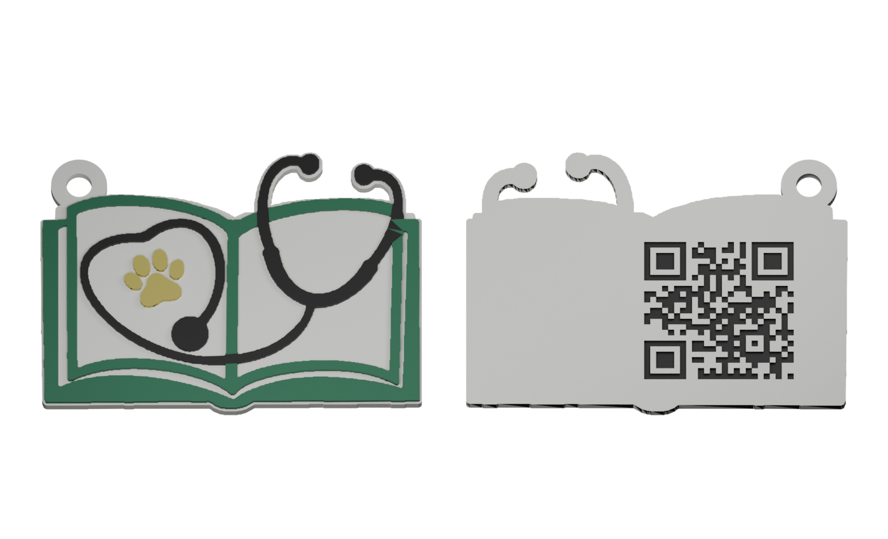

# Book and stethoscope QR keychain

The latest revision follows the book and stethoscope outline, adds an external keyring ear, and enlarges the recessed QR code on the back.

## Download

- [Complete keychain STL](stl/keychain_complete.stl)
- [Front half](stl/keychain_front_glue_half.stl) and [QR back half](stl/keychain_qr_glue_half.stl), for printing face-up and gluing together
- [Blender mesh project](blender/keychain.blend)
- [Print notes](PRINT_NOTES.md), [validation](validation/mesh-and-qr.json), and [build scripts](source/)

The complete keychain measures approximately **62.7 × 46.4 × 3.9 mm**. The keyring ear has a 9.2 mm outside diameter and a 4.2 mm hole. The recessed QR encodes `www.thedvmauthor.com`; its full footprint with the blank margin is 32.5 mm square.

For the two-piece option, print the flat backs on the plate, with the artwork and QR upward, then glue the backs together. The preview shows suggested painting, not saved filament assignments. Paint the QR recesses dark against a light background and keep the blank margin clear.

The saved QR projection decoded digitally, and all three meshes passed the recorded solid checks. Physical printing, keyring strength, and scanning remain untested. Check the actual finished QR with a phone before use.

The logo and QR inputs were supplied for this project. They are included under [inputs](inputs/) so the generator can be rerun; no independent ownership claim is made over the logo or branding.
