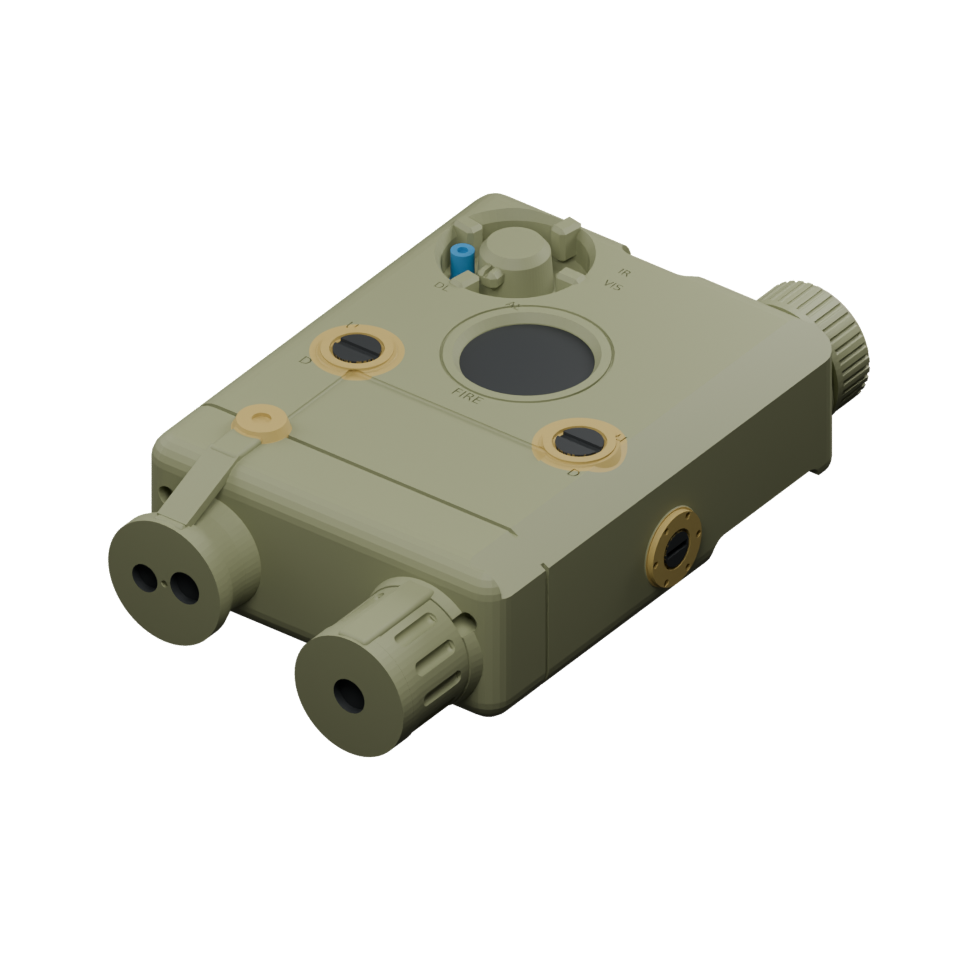

# PEQ-15 cosmetic miniature

Revision 4 is a solid decorative accessory for a GoatGuns AR15 miniature. Its exterior is reconstructed from photographs; it is not a functional laser device or a verified 1:1 scan.

## Files

- [Colorable 7.4 mm-channel 3MF](3mf/PEQ15_colorable_7p4mm.3mf), the starting file for multicolor printing.
- [7.2 mm](3mf/PEQ15_colorable_7p2mm.3mf) and [7.6 mm](3mf/PEQ15_colorable_7p6mm.3mf) channel alternatives.
- [Single-solid STLs](stl/), [rail-fit samples](fit-tests/), and [Blender project](blender/peq15_v4.blend).
- [Geometry validation](validation/) and [source scripts](source/).

The assembled print is approximately **40.03 mm long, 23.44 mm wide, and 13.23 mm high**. The 3MF has 21 named color parts, including the housing, covers, straps, controls, and miniature mount. These are adjoining regions of one print, not a kit designed to be printed separately and assembled.

## Fit and printing

The channel dimensions are provisional. One dot identifies the 7.2 mm fit sample, two dots identify 7.4 mm, and three dots identify 7.6 mm. Choose the matching full model only after testing the sample on the miniature rail. Physical fit has not been tested or manufacturer-verified.

The samples are oriented with their channels vertical. The full model is supplied with its mount down. Assess supports beneath the body and covers in your slicer. Fine markings and small color regions may disappear with a coarse nozzle or line width. No printer-specific supports or slicing settings are included.

In a multicolor slicer, import the 3MF as one object with multiple parts, keep their relative positions, and assign filament to each part. Avoid arranging the color regions independently.

## Checks and reference limits

The final STL files passed watertightness, winding, connectivity, positive-volume, triangle-area, and edge-incidence checks. Each 3MF part passed watertightness and winding checks. Their union matches the original STL within 0.0001 mm³. Four Blender views of the exported main STL were inspected, and the color preview was rendered from the actual 3MF meshes.

The final mesh retains the original CAD rounding. An additional Blender bevel pass failed topology checks and was removed. Dimensions and colors remain editable, but the Blender project contains triangulated meshes rather than parametric CAD features.

Reference pages: [L3Harris ATPial](https://www.l3harris.com/all-capabilities/advanced-target-pointer-illuminator-aiming-laser-atpial-an-peq-15), [TNVC photo gallery](https://tnvc.com/shop/atpial-anpeq-15-advanced-target-pointerilluminator-aiming-laser/), and [GoatGuns AR15 miniature](https://www.goatguns.com/products/miniature-ar15). Reference photographs are not redistributed here.
